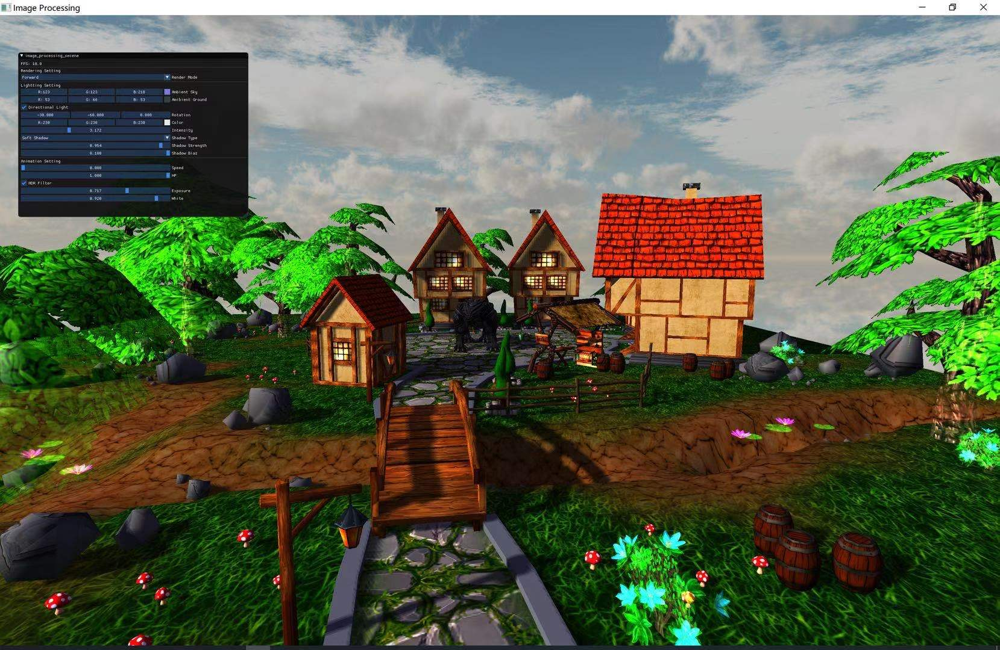
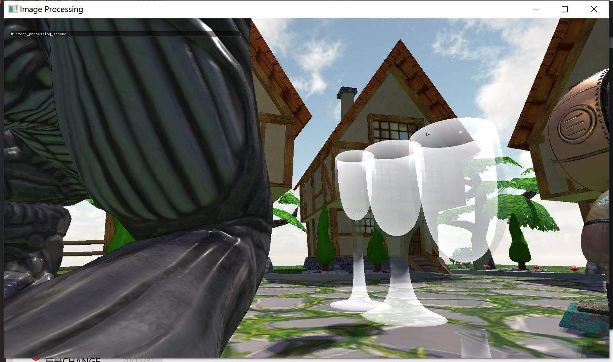
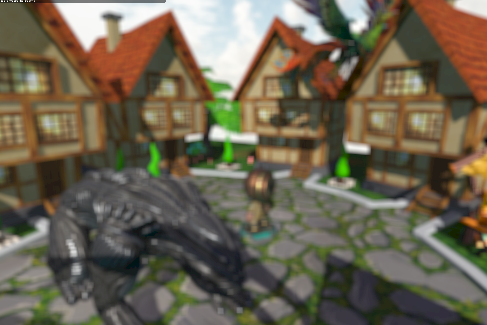

# OpenGL 3D Renderer
>该project是在学习OpenGL API 之余，尽可能把实时渲染涉及的各个概念模块化，整合成一个渲染引擎的原型

## 主要功能包括 
- Component Base Game Object System
- Assimp Base Mesh and Skeleton Animation Loading System
- Directional Light, Point Light, Spot Light, Hemipherical Ambient Light
- Blinn-Phong, PBR Lighting Model
- Directioanl Cascade Shadow Mapping, Point Light Omnidirectional Shadow Mapping, Spot Light Shadow Mapping
- Finite Machine State Base Animation System
- Animation Transition And Blending
- Forward/Deferred Rendering Pipeline
- Order Independent Transparency
- Post Processing Stack

### Feature Showcase

#### PBR金属材质

#### PBR 非金属材质

#### 动画系统动画过渡与融合

#### 动画系统

#### HDR

#### Order Independent Transparency

#### Guassian Blur Post Processing 

